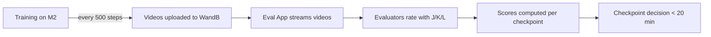

# WanGame Eval

**Keyboard-first evaluation tool for AI-generated Minecraft videos.**

Rate. Compare. Export. Under 20 minutes per checkpoint.

🌐 **[Live Demo / Docs →](https://gindachen.github.io/wangame-eval/)**

---

## Quick Start

```bash
# 1. Clone & install
git clone https://github.com/GindaChen/wangame-eval.git
cd wangame-eval && pip install -e .

# 2. Start the server
python run.py --port 8765
```

Open `http://localhost:8765` → **Settings** → paste your [WandB API key](https://wandb.ai/authorize) → **Save** → **Test Connection**.

Then go to **Evaluate** or **Matrix** and start rating.

### Keyboard Shortcuts

| View | Keys | Action |
|---|---|---|
| **Evaluate / Matrix** | `J` `K` `L` | Bad · Skip · Good |
| **Evaluate / Matrix** | `U` `O` | Previous · Next |
| **Matrix** | `← ↑ ↓ →` | Navigate cells |
| **All** | `Space` | Play / Pause |
| **All** | `R` | Replay |
| **Evaluate** | `1` `2` `3` `4` | Set speed 1-4× |
| **Reason Tagger** | `1`–`9` | Toggle reason tags |
| **Reason Tagger** | `Enter` / `Space` | Save & advance |

## Features

| Page | Description |
|---|---|
| **Dashboard** | Progress stats, export/import JSONL ratings |
| **Evaluate** | Card-style sequential evaluation with prefetch |
| **Matrix** | Side-by-side grid (rows = prompts, cols = steps) |
| **Review** | Overview grid + card-based reason tagger for bad videos |
| **Results** | Per-checkpoint scores and rankings |
| **Settings** | WandB connection, evaluator name, run selection |

### Storage

Ratings are saved to **`data/ratings.jsonl`** — one JSON object per line, appended immediately on each evaluation. Human-readable, Git-friendly. Export and import from the Dashboard.

```bash
# Count ratings
wc -l data/ratings.jsonl

# View latest 3
tail -3 data/ratings.jsonl | python3 -m json.tool --no-ensure-ascii
```

Settings are stored in `data/config.json`. The `data/` directory is in `.gitignore`.

## Architecture

```
wangame-eval/
├── run.py                    # Entry point
├── app/
│   ├── server/
│   │   ├── main.py           # FastAPI app factory
│   │   ├── storage.py        # JSONL/JSON file-based storage
│   │   ├── auth.py           # Auth + dependency injection
│   │   └── routes/
│   │       ├── data_ops.py   # Ratings, export/import, health
│   │       ├── videos.py     # WandB proxy + caching
│   │       ├── settings.py   # Settings CRUD
│   │       └── results.py    # Score computation
│   └── frontend/
│       └── public/           # Static: index.html, app.js, css/
├── data/                     # Ratings + config (gitignored)
│   ├── ratings.jsonl
│   └── config.json
└── docs/                     # GitHub Pages site
```

## Pipeline Overview



**Data flow:** Training generates validation videos every 500 steps → uploaded to WandB (source of truth) → Eval App streams via proxy with local caching → ratings saved to JSONL.

## Subprojects

### SP1: Evaluation App ✅

Functional web app with card-style eval, matrix comparison, review workflow, keyboard-first rating, JSONL storage, and video proxy with caching.

### SP2: Scoring & Analysis 🔲

Per-task scoring rubrics, difficulty-adjusted tolerance, trend tracking across runs. Currently: per-checkpoint aggregate scores from ratings.

### SP3: Prompt Design 🔲

Expand from 32 → ~120 prompts with balanced task × scene difficulty coverage. Categorize 23 actions into evaluatable task groups.

## Documents

| Document | Description |
|---|---|
| [Executive Brief](docs/eval_pipeline_exec_brief.md) | One-page problem + proposal |
| [Summary Report](docs/eval_pipeline_summary.md) | Problem, solution, action items |
| [Full Meeting Notes](docs/eval_pipeline_full.md) | All technical details |
| [UI Design Spec](docs/ui_design_spec.md) | Frontend design specification |

## References

- **WandB Project:** [wangame_1.3b](https://wandb.ai/kaiqin_kong_ucsd/wangame_1.3b)
- **Model:** 1.3B parameter Minecraft world model
- **Validation:** 32 prompts, 77 frames each, every 500 training steps
- **Target:** ~120 prompts, evaluated by 5 people in < 20 min
