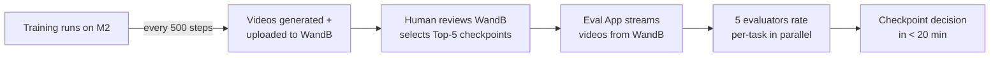
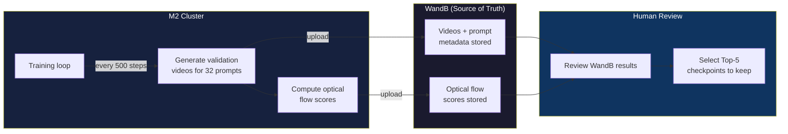
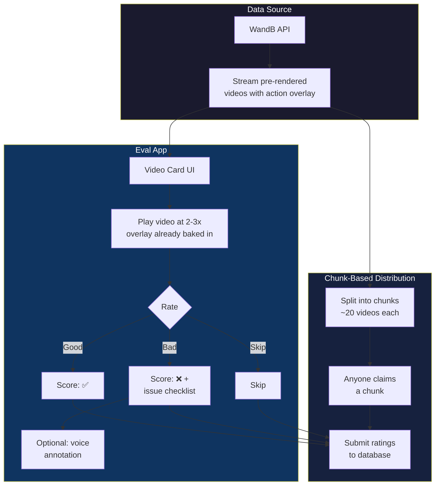
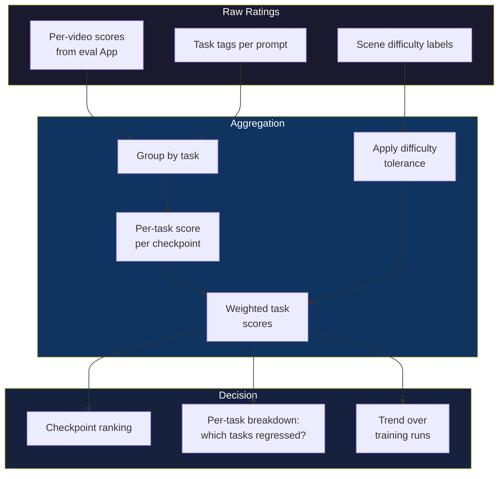
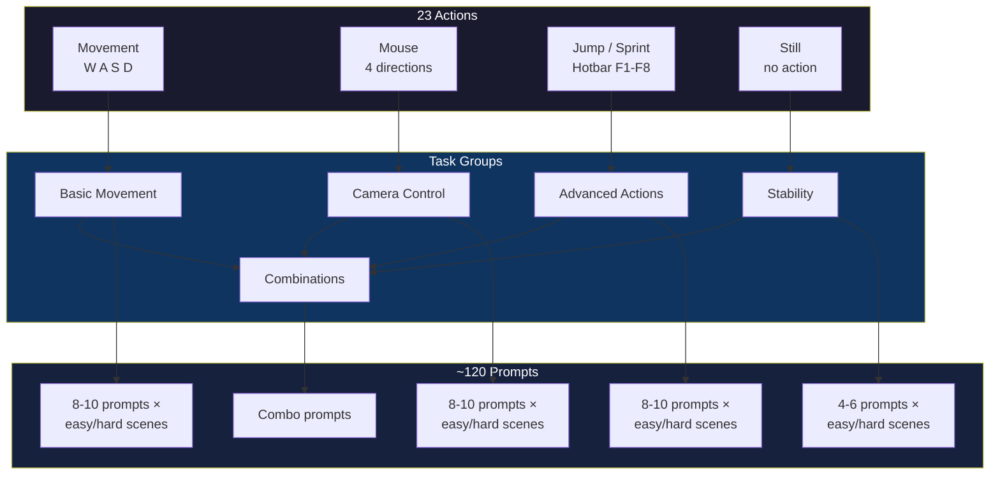

# WanGame Eval

**Mission:** Build a scalable, task-based evaluation pipeline for the WanGame 1.3B Minecraft World Model — replacing ad-hoc eyeballing with structured, team-parallel human evaluation that delivers results in under 20 minutes post-training.

## Quick Start

### Prerequisites

- Python ≥ 3.10
- A [WandB](https://wandb.ai) account with access to the training project

### 1. Install

```bash
git clone https://github.com/GindaChen/wangame-eval.git
cd wangame-eval
pip install -e .
```

### 2. Get your WandB API Key

Go to **[wandb.ai/authorize](https://wandb.ai/authorize)** → copy your API key. You'll need this to stream videos from the training runs.

### 3. Start the server

```bash
python run.py --port 8765
```

This will:
- Create a SQLite database (`eval.db`) automatically on first run
- Serve the frontend at `http://localhost:8765`
- Expose API docs at `http://localhost:8765/docs`

### 4. Configure

Open `http://localhost:8765` and go to **Settings**:
1. Paste your **WandB API Key**
2. Set **Entity** (default: `kaiqin_kong_ucsd`)
3. Set **Project** (default: `wangame_1.3b`)
4. Set **Run ID** (default: `fif3z1z4`)
5. Click **Save Settings** → **Test Connection**

### 5. Start evaluating

| Page | Purpose |
|---|---|
| **Dashboard** | Overview stats, chunk progress, quick actions |
| **Evaluate** | Tinder-style card view — rate videos Good/Bad/Skip |
| **Review** | Overview of all rated videos + card-based reason tagger for bad videos |
| **Matrix** | Side-by-side grid (rows=prompts, cols=steps) for desktop comparison |
| **Results** | Per-checkpoint scores and rankings |

**Keyboard shortcuts (Evaluate):** J=Bad, K=Skip, L=Good, ←→=Navigate, 1-4=Speed, Space=Play/Pause

**Keyboard shortcuts (Matrix):** Arrow keys=Navigate cells, J/K/L=Rate, Tab=Cycle, Space=Play/Pause

**Keyboard shortcuts (Reason Tagger):** 1-9=Toggle reasons, Enter/Space=Save & advance, K=Skip

## Mission Overview



## Current Status

🟢 **In Progress** — Evaluation app is functional with video streaming, rating, matrix comparison, and review workflow.

---

## Data Pipeline (✅ Already Working)

The data pipeline is **already in place** and does not require further work:



**How it works today:**
- Training runs on M2, and **every 500 steps** it automatically generates validation videos for all prompts and computes optical flow scores
- Videos and scores are **uploaded from M2 to WandB** with prompt metadata
- WandB accumulates all validation results across the entire training run
- A human reviews WandB to select the **Top-5 best checkpoints** (based on optical flow + eyeballing)
- Every 5K steps, a round-number checkpoint is also saved

**What remains:** The pipeline produces the data. The remaining work is about what happens *after* the data lands in WandB — better tooling for evaluation (SP1), better scoring (SP2), and better prompt coverage (SP3).

---

## Subprojects

### SP1: Evaluation App

**Mission:** A Tinder-style web app for fast, team-parallel human evaluation of generated videos, streaming directly from WandB.

**Key detail:** Videos from WandB already have the action overlay pre-rendered — the App just plays them as-is (no compositing needed).



**Scope:**
- Per-video card: play pre-rendered WandB video (already has action overlay) at 2-3x, rate good/bad/skip
- Category-specific issue checklists per task type
- **Chunk-based work:** Videos split into chunks of ~20. Designed for single-person use first — one person works through chunks sequentially. Scales to multiple people if needed (anyone claims a chunk, submits to database).
- **Progress tracking:** Query the database to see which chunks/videos are ✅ finished vs ⬜ remaining. Essential for knowing what's left and resuming work.
- Stretch: on-demand video generation (define ad-hoc action sequence → generate → evaluate)
- Key principle: evaluate each video independently, never compare two checkpoints side-by-side

**Database & Infrastructure:**
- **Write protocol:** Append-only — ratings are only inserted, never updated or deleted. No concurrency issues.
- **Hosting:** RunPod CPU instance
- **Backup strategy:** Rotating backups — keep 10 backups, create one every 5 minutes, delete oldest outside the retention window

---

### SP2: Scoring & Analysis

**Mission:** Define how per-video ratings become per-task scores and overall checkpoint rankings.



**Scope:**
- **Depends on SP3** for task categorization — before that's done, scoring works at per-video granularity (still useful)
- Once tasks are categorized: per-task scoring rubrics with difficulty-adjusted tolerance
- Aggregation method: per-task → overall ranking (not just "who wins most videos")
- **Inspection view:** For each video × checkpoint, drill into the human score to understand what went wrong
- Results dashboard / trend tracking across training runs
- Comparison with optical flow scores for metric calibration

---

### SP3: Prompt Design & Task Taxonomy

**Mission:** Define what we test and how — categorizing the 23 actions into evaluatable task groups with balanced coverage.



**Scope:**
- Categorize existing 32 prompts by task type (delegatable — anyone with the dataset can propose)
- Design task taxonomy for all 23 actions
- Expand from 32 → ~120 prompts with balanced task × scene difficulty coverage
- Codify model behavior expectations (stops at obstacles, no auto-jump, no wall collision)
- Split GT data from training set into validation partition

---

## Documents

| Document | Audience | Description |
|---|---|---|
| [Executive Brief](docs/eval_pipeline_exec_brief.md) | Stakeholders | One-page problem + proposal |
| [Summary Report](docs/eval_pipeline_summary.md) | Team leads | Problem, current state, proposed solution, action items |
| [Full Meeting Notes](docs/eval_pipeline_full.md) | Contributors | Everything discussed, all technical details |
| [Raw Working Notes](docs/meeting_notes_raw.md) | Reference | Structured working notes |
| [Meeting Transcript](docs/meeting_transcript_raw.md) | Archive | Original verbatim meeting transcription (4 segments) |

## Key References

- **WandB Project:** [wangame_1.3b](https://wandb.ai/kaiqin_kong_ucsd/wangame_1.3b/runs/fif3z1z4?nw=nwuserjunda)
- **Model:** 1.3B parameter Minecraft world model
- **Actions:** 23 types (movement, mouse, jump, hotbar F1-F8, sprint, still)
- **Data format:** 77 frames × 23-dim binary vector per prompt
- **Current validation:** 32 prompts, videos generated every 500 training steps
- **Target validation:** ~120 prompts, evaluated by 5 people in <20 min
