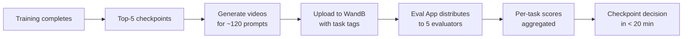
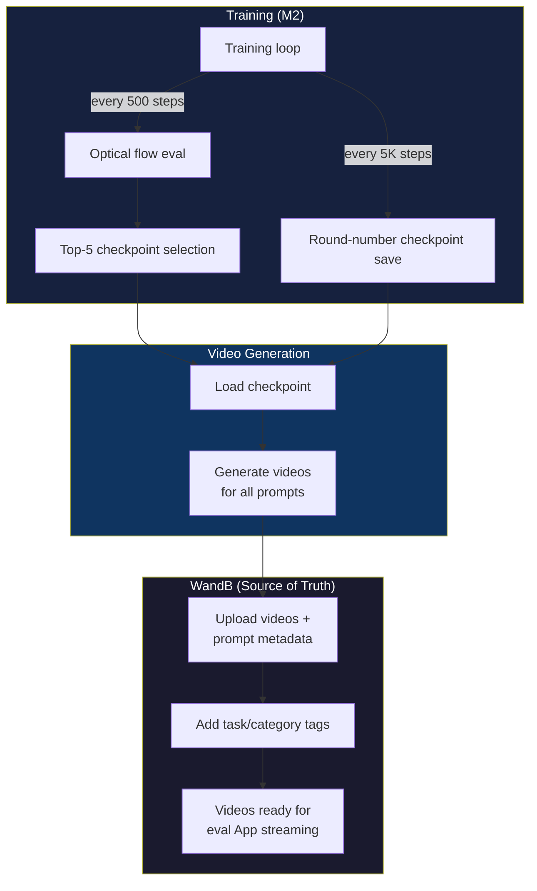
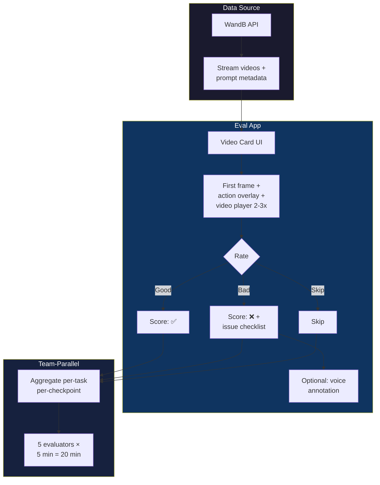
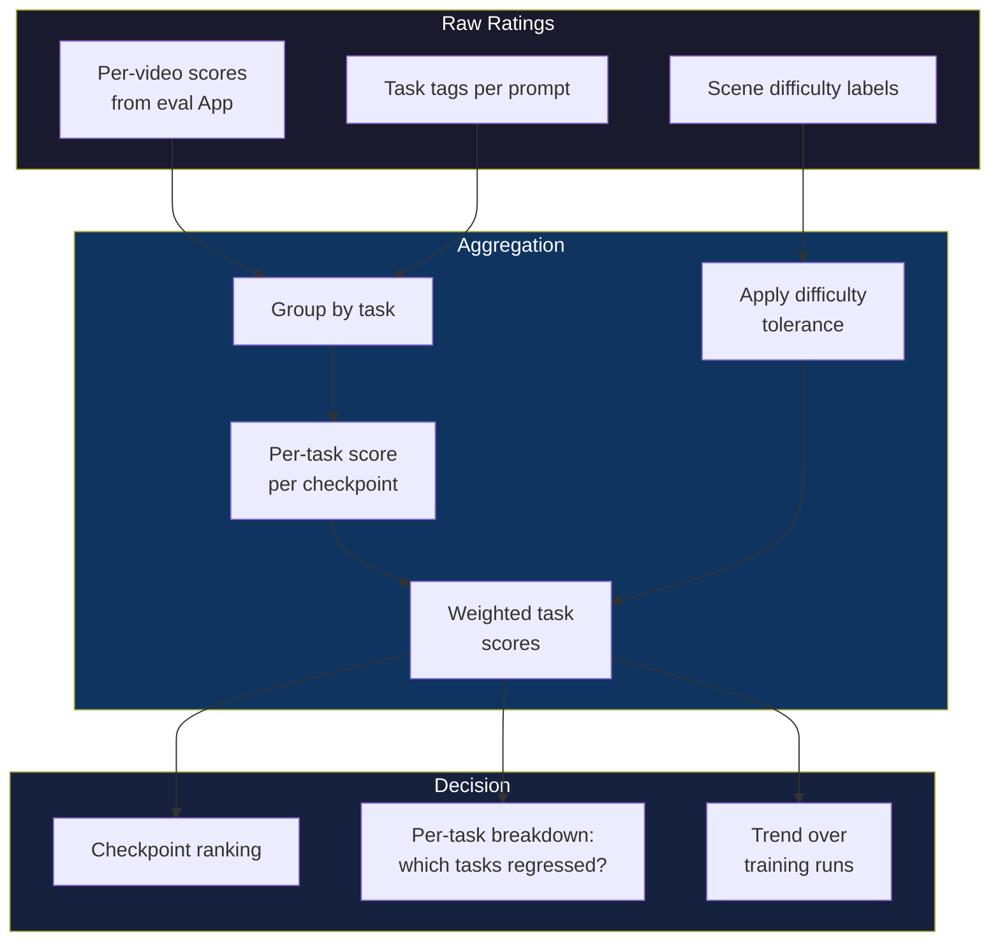
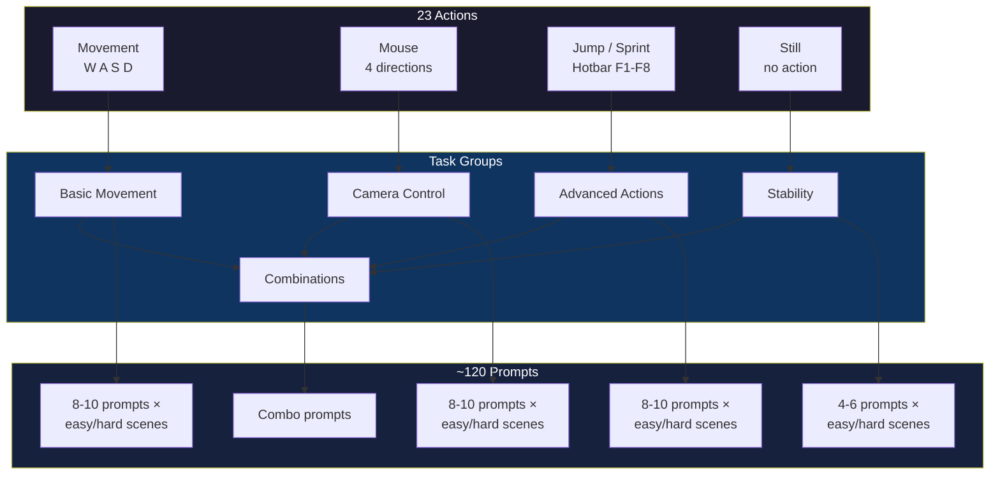

# WanGame Eval

**Mission:** Build a scalable, task-based evaluation pipeline for the WanGame 1.3B Minecraft World Model — replacing ad-hoc eyeballing with structured, team-parallel human evaluation that delivers results in under 20 minutes post-training.

## Mission Overview

## Why This Repo Exists

We train a world model that generates Minecraft gameplay video from a starting frame + action sequence. The model handles 23 distinct action types, but we currently have no scalable way to evaluate checkpoint quality. Our automated metric (optical flow) is unreliable, and manual eyeballing on 32 ad-hoc prompts doesn't cover enough ground.

This repo is the home for everything needed to fix that — from evaluation design to tooling to results.

## Current Status

🟡 **Design phase** — Evaluation architecture is defined (see docs). Implementation has not started.

---

## Subprojects

### SP1: Data Pipeline

**Mission:** Automate the flow from training checkpoint → video generation → WandB → evaluation-ready data.

**Key clarification:** Videos are streamed from **WandB**, not M2. WandB is the source of truth — training uploads validation videos with prompt metadata during training. The eval App reads directly from WandB.

**Scope:**
- Automate post-training video generation (checkpoint + prompt set → video batch)
- Add task/category tags to WandB prompt metadata
- Extract evaluation-ready pairs from existing WandB data
- GT video recording via Minecraft simulator (delegatable)

---

### SP2: Evaluation App

**Mission:** A Tinder-style web app for fast, team-parallel human evaluation of generated videos.

**Scope:**
- Per-video evaluation card: first frame, action key overlay, video at 2-3x, rating controls
- Category-specific issue checklists per task type
- Team-parallel: distribute video slices across 5 evaluators
- Stretch: on-demand video generation (define ad-hoc action sequence → generate → evaluate)
- Key principle: evaluate each video independently, never compare two checkpoints side-by-side

---

### SP3: Scoring & Analysis

**Mission:** Define how per-video ratings become per-task scores and overall checkpoint rankings.

**Scope:**
- Per-task scoring rubrics with difficulty-adjusted tolerance (flat terrain = zero tolerance, complex = some OK)
- Aggregation method: per-task → overall ranking (not just "who wins most videos")
- Results dashboard / trend tracking across training runs
- Comparison with optical flow scores for metric calibration

---

### SP4: Prompt Design & Task Taxonomy

**Mission:** Define what we test and how — categorizing the 23 actions into evaluatable task groups with balanced coverage.

**Scope:**
- Categorize existing 32 prompts by task type (delegatable — anyone with the dataset can propose)
- Design task taxonomy for all 23 actions
- Expand from 32 → ~120 prompts with balanced task × scene difficulty coverage
- Codify model behavior expectations (stops at obstacles, no auto-jump, no wall collision)
- Split GT data from training set into validation partition

---

## Documents

| Document | Audience | Description |
|---|---|---|
| [Executive Brief](docs/eval_pipeline_exec_brief.md) | Stakeholders | One-page problem + proposal |
| [Summary Report](docs/eval_pipeline_summary.md) | Team leads | Problem, current state, proposed solution, action items |
| [Full Meeting Notes](docs/eval_pipeline_full.md) | Contributors | Everything discussed, all technical details |
| [Raw Working Notes](docs/meeting_notes_raw.md) | Reference | Structured working notes |
| [Meeting Transcript](docs/meeting_transcript_raw.md) | Archive | Original verbatim meeting transcription (4 segments) |

## Key References

- **WandB Project:** [wangame_1.3b](https://wandb.ai/kaiqin_kong_ucsd/wangame_1.3b/runs/fif3z1z4?nw=nwuserjunda)
- **Model:** 1.3B parameter Minecraft world model
- **Actions:** 23 types (movement, mouse, jump, hotbar F1-F8, sprint, still)
- **Data format:** 77 frames × 23-dim binary vector per prompt
- **Current validation:** 32 prompts × 5 checkpoints = 160 videos per eval round
- **Target validation:** ~120 prompts × 5 checkpoints = 600 videos, evaluated by 5 people in <20 min
